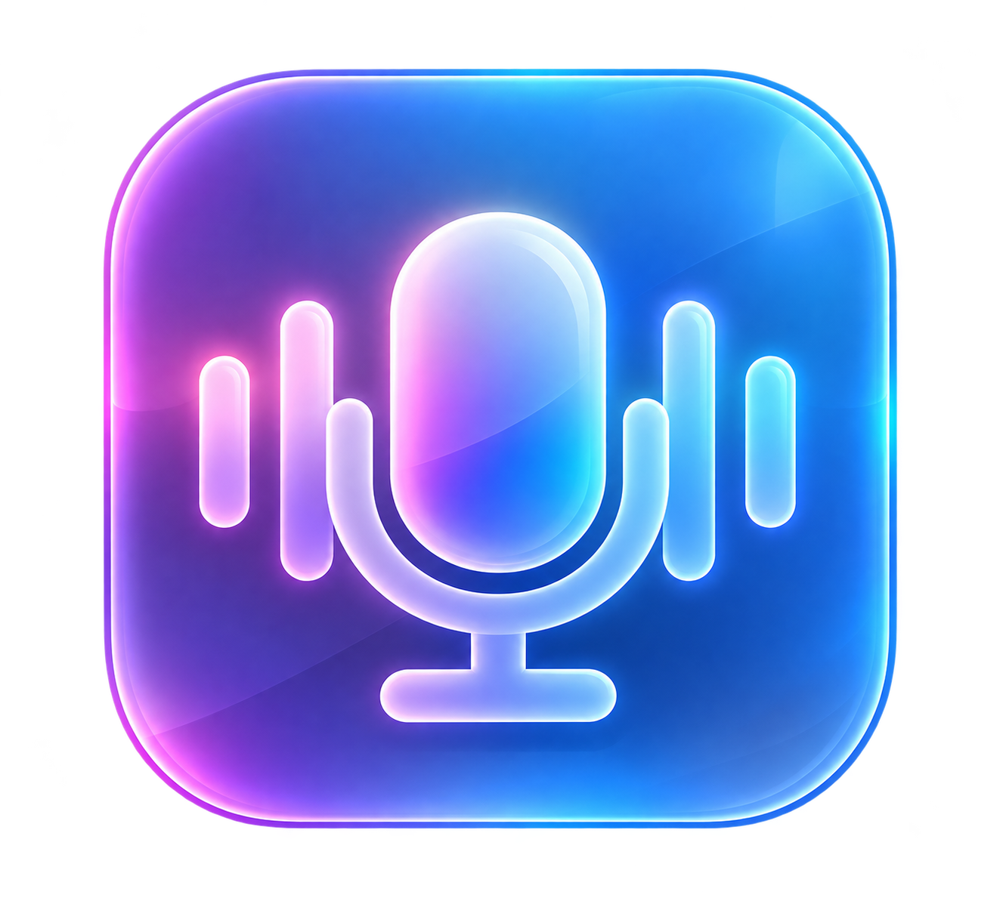

<div align="center">
  
</div>

<div align="center">
  <h1>Make any sound one tap away.</h1>
  <p><i>A fast, open-source soundboard for Windows, controlled from your phone.</i></p>
</div>

<p align="center">
  <a href="https://github.com/js664/SoundBoardify/releases">Releases</a> &nbsp;|&nbsp;
  <a href="#build-it-yourself">Build it yourself</a> &nbsp;|&nbsp;
  <a href="https://github.com/js664/SoundBoardify/issues">Report a bug</a>
</p>

<p align="center">
  <a href="https://github.com/js664/SoundBoardify/actions/workflows/windows-build.yml"></a>
  
</p>

## Your soundboard, wherever you need it

Play clips from your PC or tap them from your phone on the same Wi-Fi. Add artwork, arrange buttons, tune each sound’s volume, and choose where audio plays. Tailscale access is optional.

- **Quick playback** with retriggering and per-sound volume.
- **Phone control** through a Wi-Fi/LAN QR code. Pairing protection is available in Settings.
- **Your audio devices** with Windows defaults detected automatically and optional local monitoring.
- **Your layout** with custom images, button ordering, and a mobile-first board.

Download the Windows **installer** or **portable app** from [Releases](https://github.com/js664/SoundBoardify/releases). The installer adds Start Menu and optional desktop shortcuts; the portable app runs without installation. Open Soundboardify and scan the **Wi-Fi / LAN QR** with your phone. If Windows blocks the connection, choose **Allow app in Windows Firewall** in Settings and approve the prompt. Tailscale is off by default.

## Build it yourself

On Windows 10 or 11, install the **.NET 10 SDK** and **Node.js 22.12 or newer**, then run:

```powershell
git clone https://github.com/js664/SoundBoardify.git
cd SoundBoardify
cd electron
npm ci
npm run dist
```

The installer and portable app are created in `dist-electron/`. Run `npm test` from `electron/` for the update-check tests, and `dotnet test tests/SoundBoardify.Tests/SoundBoardify.Tests.csproj -c Release -r win-x64` from the project root for the audio and application tests.

GitHub Actions runs the tests and builds the Windows app. To publish a release, update the version in `electron/package.json` and its lockfile, push a matching `vX.Y.Z` tag, then attach that run’s Windows artifact to a GitHub Release.

## License and credits

Soundboardify is MIT licensed. See [LICENSE](LICENSE) and [CREDITS](CREDITS.md).
